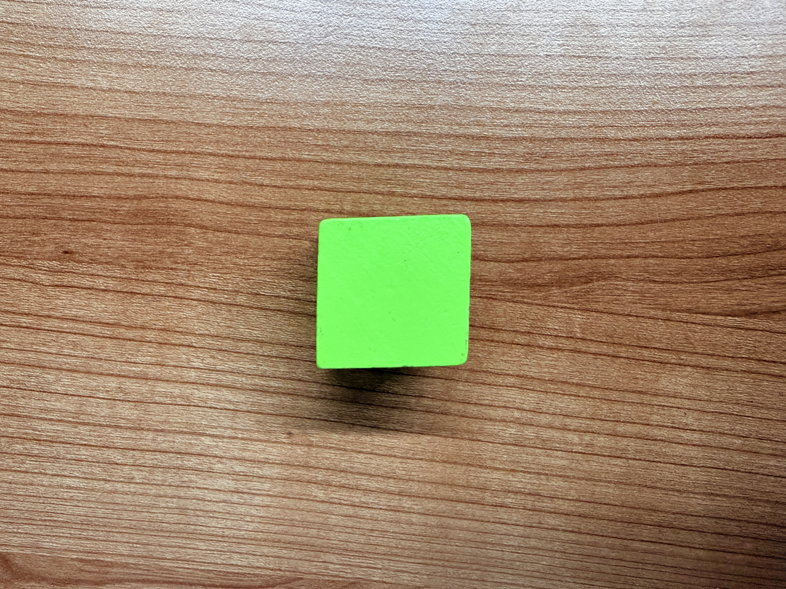
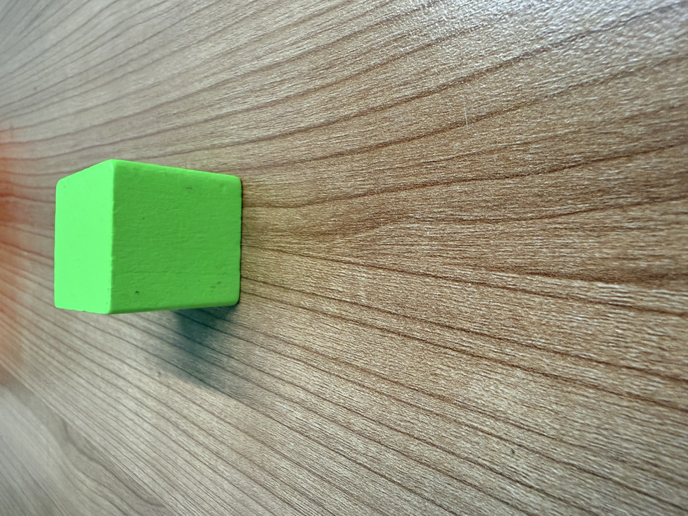

# Real-Robot Track — prize pool, claim period and challenges

> **Status**: current · **Updated**: 2026-09-05 · **Audience**: miners entering the
> xArm 6 seasons. Where a number here disagrees with the season row on
> `GET /api/v1/competitions`, the season row wins.

This is the only document that states the real-robot track's reward rules. The
entry flow (`openroboto init` → `check` → `submit`) is in [MINER.md](./MINER.md);
what the fee costs and when it is wasted is in [PAYMENT.md](./PAYMENT.md).

## 1. Format

- The track runs as **tournament seasons**, back-to-back, roughly one a month. Each
  season is a fixed submission window, then evaluation on a physical UFACTORY xArm 6
  workcell, then **one champion**. The window and evaluation dates are on the season
  record.
- An entry is the exact Hugging Face revision recorded at submission. Pushing new
  commits afterwards does not update it — resubmit instead. When the window closes the
  roster is locked; no model is replaced after that.
- Private repositories are allowed **while the season is being evaluated**, provided
  the official `openroboto-ai` account has read access before you submit. If the
  recorded revision cannot be downloaded, the entry is disqualified. Once an entry is
  rewarded, privacy ends — see §5.

## 2. Task set and qualification bar

### Baseline task

**Pick up one green block.** Place a single green block on the tabletop. The
physical xArm 6 must grasp the block with its gripper and lift it clear of the
tabletop.

- **Object:** one green block, 35 mm high and 33 mm wide.
- **Success:** the recorded trial shows the block held by the gripper with visible
  separation from the tabletop.
- Touching or pushing the block, or closing the gripper without lifting it, does
  not count as success.
- No basket, plate, placement step, or additional object is required.

Reference photographs of the block (not to scale):




Height: **35 mm**. Width: **33 mm**. The remaining dimension is not specified.

This defines the baseline task, not a baseline score or evidence of a completed
evaluation. The published, locked specification remains authoritative for each
season; this documentation update does not change an already locked task set.

### Qualification bar

- The **task list, the success criteria and the qualification bar are published and
  locked at the submission deadline**. Nothing about how a season is scored changes
  after that moment.
- The bar is derived from the official baseline model: the median score of five
  baseline runs on the season's task set, plus at least one successful trial in each
  task category.
- Plagiarism is a hard disqualification. An entry found to be a copy or trivial
  re-upload of another team's model takes nothing, whatever its score. If that leaves
  the top of the board without a qualified entry, the champion's share is burned rather
  than passed down; if no legitimate entry qualifies at all, the whole season's prize is
  burned.

## 3. Prize pool and settlement

- The track has its **own prize-pool hotkey**, registered on this subnet as **UID 2**:
  `5HVjAxFQ36vsNPcAWP5LBefutCtw8ishCCQj6VRfsDvERAZo`. While a season's submission window
  is open, **20% of the subnet's emissions** accrue to that hotkey.
- The pool holds nothing but this track's rewards, so its balance — and every payout
  that leaves it — can be checked on chain against the season record:

  ```bash
  btcli subnet metagraph --netuid 80 --network finney   # UID 2 and its share
  ```
- Settlement happens **once per season**, on what accrued during that season:
  - **95%** to the single champion, vested linearly over **120 days**;
  - **5%** shared equally by every entry that clears the qualification bar, vested over
    **30 days**.
- Vesting schedules are independent: a later season never interrupts an earlier one.
- Anything the rules stop from reaching a rewarded entry is **burned**, and the burn is
  recorded publicly. If no entry qualifies, the whole season's prize is burned.

## 4. Auditability

A physical run cannot be re-seeded like a simulation, so the record has to carry the
proof.

- Every official trial is recorded on **complete video** and logged with the task, the
  object layout, the outcome, the judgment reason, the evaluated revision and the
  timestamp.
- The videos and the records are published with the leaderboard and exposed through
  the API, so the score a run received can be checked against what the robot actually
  did.
- A trial voided by a workcell fault is re-run and stays in the record marked as such.
  It is never counted as a model failure.
- The evaluated revision is the exact Hugging Face commit pinned at submission, and the
  hardware protocol is part of the season record, so a published result ties to one
  checkpoint, one protocol and one set of recordings.

## 5. Claim period, public weights and challenges

- Rewards are paid over time — 120 days for the champion, 30 days for qualified
  entries — and that whole span is the **claim period**.
- For as long as an entry is being paid, **its Hugging Face repository and the rewarded
  revision must stay public**. Taking the repository private, deleting it or removing
  the revision stops the payouts; whatever has not yet been paid is burned.
- During the claim period **anyone** — a miner, a validator, anyone at all — can
  **challenge** a rewarded entry for cheating: a copied or trivially re-uploaded model,
  misrepresented training, tampering with the evaluation, or any other breach of the
  season rules.
- Challenges are filed as **public issues** on
  [`openroboto-ai/openroboto-subnet`](https://github.com/openroboto-ai/openroboto-subnet/issues)
  with the evidence attached, so the accusation and the response stay on the record.
  Title the issue `Challenge: <season> — <hotkey>`.
- We rule **within seven days** and publish the ruling with its reasoning.
- If the challenge is **upheld**, every reward not yet paid is **burned** and the burn
  is recorded publicly. Payments already made are not clawed back, and the champion
  slot is not passed down to the next entry.
- If it is **not upheld**, payouts continue. The ruling stays public either way.
- A challenge can only remove rewards; it can never grant them to anyone else.

## 6. Outcomes at a glance

| Situation | Outcome |
|---|---|
| `openroboto-ai` account cannot download the submitted revision | Disqualified |
| Repository incomplete — missing weights, config, or processor files | Disqualified |
| Checkpoint fails to load or crashes on the evaluation harness | Disqualified, reason shown on the roster |
| Copy or trivial re-upload of another team's model | Disqualified, whatever the score |
| Repository or rewarded revision made private or deleted during the claim period | Payouts stop; the unpaid remainder is burned |
| Challenge upheld during the claim period | Unpaid remainder burned; the ruling is published |
| No entry clears the qualification bar | The whole season's prize is burned, publicly recorded |

## 7. Finality

Season results are final once published — an entrant cannot appeal a score. The
challenge process in §5 is the one route that can change an outcome, and it only runs
one way: it can strip rewards from an entry that cheated, never grant them to another.
