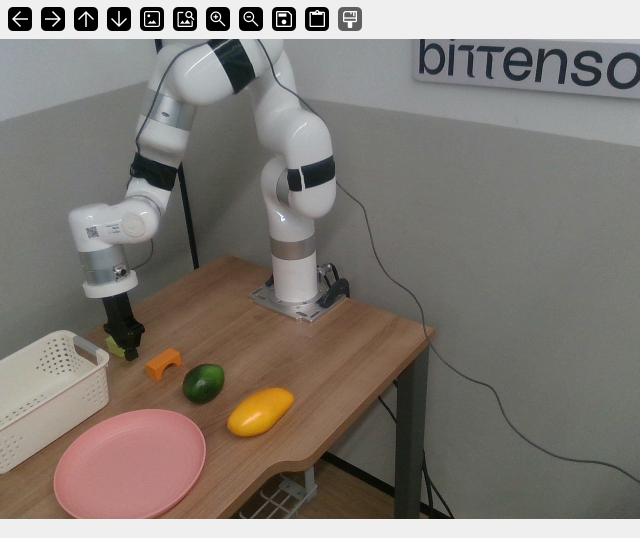

# Workstation model interface and reference data

> Interface reference updated 2026-09-15 from the workstation team's execution
> and training specifications. This is an interface description, not a robot
> performance report.

This page describes the π0.5 joint-space model interface on the physical xArm6
workstation. Model-family loading and export requirements remain separate;
use the runtime for the selected competition.

## State and action contract

| Field | Ordered physical representation | Meaning |
|---|---|---|
| State, 7 values | `[q1, q2, q3, q4, q5, q6, g]` | Measured absolute joint positions and binary gripper command state |
| Action, 7 values per step | `[Δq1, Δq2, Δq3, Δq4, Δq5, Δq6, g]` | Joint-position deltas and a gripper closing score |
| Joint order and units | Native xArm6 Joint 1 through Joint 6, base to wrist | Radians |
| Canonical gripper labels | `0 = open`, `1 = close` | Unitless command labels, not measured finger spacing |

Both state and action have one gripper dimension. Gripper labels are defined
before normalization or after denormalization. Training labels are binary;
model outputs can be continuous and are interpreted by the event rules below,
not sent to the hardware as intermediate opening positions.

This contract does not provide end-effector position or rotation, joint velocity,
joint torque, or force/torque sensor readings. EEF base/tool-frame rotation,
axis-angle conventions and Cartesian deltas do not apply to these joint actions.

## Delta reference and SDK conversion

All joint deltas in one predicted chunk use the same measured joint state captured
at the start of that inference:

```text
q_ref = measured joint positions at inference start
physical_actions = denormalize(model_actions, checkpoint norm_stats)

for each executed step k:
    q_target[k] = q_ref + physical_actions[k, :6]
closing_scores = physical_actions[:, 6]
# The gripper event handler examines closing_scores separately.
```

This is a semantic example, not an executable robot-control script.
Deltas are not relative to the preceding action and are not accumulated.
The workstation does not reread the joint state to redefine each step's reference.
It sends absolute joint targets through the xArm joint servo position interface.

The workstation handles SDK units, communication, radians conversion, gripper
registers and hardware-position conversion. Miners do not implement those adapters.

## Prediction and synchronous execution

| Setting | Value |
|---|---|
| Training action sampling | Nominal 30 Hz, approximately 33.3 ms per step |
| Prediction horizon | 10 steps; model-facing action chunk `10 × 7` |
| Joint target prefix | At most the first 3 joint targets per inference |
| Joint command execution | Spline planning with velocity and acceleration limits; absolute joint commands sent at 100 Hz |
| Next observation | Read a fresh image and state after segment execution and feedback completion |

Execution is synchronous; inference and execution do not overlap. The planner
retimes the selected targets. Three selected targets do not imply a fixed
100 ms execution duration. Training sampling, camera FPS, command-send frequency
and model inference frequency describe different parts of the system.

## Gripper input and action rules

During training, frame `t` uses the gripper command from frame `t-1` of the same
trajectory. The first frame uses that trajectory's first action label. This
one-frame shift does not test whether the physical gripper has finished moving.

During deployment, the arm pauses for a gripper event. The input command state
updates after terminal feedback is confirmed, then inference resumes. Intermediate
opening positions are not supplied as state. Normal startup confirms the gripper
is open and supplies `g=0`. A confirmed close/contact-candidate state supplies
`g=1` even when the fingers remain separated. This state alone does not prove a
successful grasp. After an empty-grasp recovery reopens the gripper and confirms
opening, the input returns to `g=0`.

| Event parameter | Value |
|---|---|
| Close threshold | Denormalized closing score ≥ 0.65 |
| Open threshold | Denormalized closing score ≤ 0.35 |
| Consecutive support | 2 consecutive prediction rows supporting the same event |
| Minimum event interval | At least 0.5 seconds since the last confirmed event |
| Lookahead | First 7 rows of the 10-step prediction |
| More distant future event | Support from 3 distinct observations before locking its execution position |
| Feedback timeout | Default maximum 8 seconds |

A score strictly between 0.35 and 0.65 does not by itself trigger a new event.
An event also needs the consecutive-support and timing conditions above.
Timeout, fault or contradictory feedback stops the gripper and ends the trial;
the task does not continue.

## Camera and image preprocessing

| Item | Confirmed specification |
|---|---|
| Camera | One Intel RealSense D415, fixed third-person RGB view |
| Mount | In front of the robot, facing the robot and main work area |
| Raw stream | RGB, 640 × 480, 30 FPS |
| Acquisition | Continuous streaming throughout the episode; sample the latest frame for each observation |
| π0.5 image input | RGB, 224 × 224 via OpenPI-compatible `resize_with_pad` |
| Additional inputs | No wrist camera, second camera or depth input |
| Cropping | No extra center crop or manually selected ROI crop by default |

Camera FPS and inference frequency are distinct. The camera is not reinitialized
for every inference. The pipeline is
`D415 RGB 640×480 → resize with padding → RGB 224×224 → π0.5`.

### Camera-view reference



Original viewer capture supplied by the workstation team, before model
preprocessing. The visible objects illustrate the scene and do not define an
evaluation task. The viewer controls are not part of the model image input.

## Normalization and checkpoint assets

π0.5 state and actions use OpenPI-compatible quantile normalization from the
checkpoint's actual fine-tuning `norm_stats.json`: the 1st and 99th percentiles
map approximately to -1 and +1. No additional model-side action scaling is defined.
Normalized outputs outside [-1, 1] are not clipped merely for exceeding that range.

State statistics describe absolute joint positions and binary gripper command state.
Action statistics describe joint deltas and binary gripper action labels,
not absolute joint targets. For training targets, convert absolute joint targets
to deltas against the inference/chunk reference before normalization.

The observation state is normalized before π0.5 inference. Model outputs are
denormalized before forming absolute joint targets and running safety checks:

```text
state: measured joints + confirmed gripper command state → [q1..q6, g] → normalization
action: normalized output → denormalization → [Δq1..Δq6, g]
        → joint targets / gripper event handling → safety check → robot
```

Keep the native OpenPI schema:

```json
{
  "norm_stats": {
    "state":   { "mean": [], "std": [], "q01": [], "q99": [] },
    "actions": { "mean": [], "std": [], "q01": [], "q99": [] }
  }
}
```

The empty arrays illustrate field names only and are not valid submission stats.
Every array must contain 7 values in the state/action order specified above.
The stats must exactly match those actually used for the submitted checkpoint's
fine-tuning. Do not substitute another checkpoint's statistics. The protocol
does not additionally require normalization-type, stats-version or reorder
metadata. Retaining mean/std fields does not change the quantile convention.

## Hardware and safety

The arm is a fixed-base UFACTORY xArm6, with an Inspire-Robots EG2-4C2 single-DOF
gripper. The miner interface does not depend on a particular xArm firmware or SDK
version; the workstation owns that integration.

Targets must respect legal xArm6 joint limits and the workstation's Cartesian
safety boundary, which applies to every part of the arm. The executor applies
velocity and acceleration limits during trajectory planning.

The workstation rejects unsafe commands and reports a safety error; a safety
violation ends the episode as a failure. It does not clip dangerous targets into
a safe range.

The flange-to-gripper TCP offset is used for geometry and safety checks, not for
direct interpretation of joint-space actions. Each episode must use a common
initial pose, represented as six absolute joint positions in radians.

The common desktop initial pose for training and physical testing is:

```text
J1..J6 (degrees): [-7.418, -5.264, -35.183, 22.942, 40.005, -29.014]
J1..J6 (radians): [-0.129468524, -0.091874132, -0.614059191, 0.400413437, 0.698218967, -0.506389829]
```

Use radians in model inputs. The degree values are an operator-facing reference.

### Measured installation reference

The [2026-09-12 workstation measurements](WORKSTATION_MEASUREMENTS.md) provide
the normal-gripper TCP translation, a rounded reference initial pose with radian
conversion, the camera-to-base transform and a one-second command-timing test.
The [measurement JSON](data/workstation-measurements-2026-09-12.json) contains the
same numerical reference. Installation-specific measurements supplement this
interface; they do not change a season's model contract or runtime configuration.

## Tasks and responsibilities

The [real-robot task catalog](REAL_TASKS.md) lists the seven shared tasks and
English instructions for π0.5 and LingBot-VLA 2.0. Each model runs 10 trials per
task, for 70 trials in its selected competition.

Each public task release must contain its unique task name, the exact fixed
language prompt passed to the model, and an example video illustrating the task
and successful completion. The task catalog is not a training dataset or
measured qualification result.

Miners supply the 7-D contract, 10-step predictions, one third-person RGB
observation input, the fixed task prompt, a complete checkpoint and matching
normalization statistics. The workstation integrates acquisition, preprocessing,
normalization/denormalization, joint-target conversion, prefix execution, safety,
TCP configuration and initial-pose control. A complete family-specific loader
and runtime test remain necessary; `openroboto check` alone does not establish
runtime compatibility or admission.

## Reference-data publication

The camera-view reference and installation measurements accompany this interface.

When data is released, include its source, collection conditions, field schema,
preprocessing, splits, allowed use, limitations, fixed revision and checksums.
Distinguish public reference/training episodes from held-out evaluation material.
A sample episode is not a complete training dataset. Evaluation records should
identify competition, model revision, workstation protocol, task, outcome and
video, distinguishing workcell faults from model failures.

Keep robot credentials, private feeds and site access details outside public docs.
Hardware operation remains with official operators; this document does not
authorize robot execution.

See [the miner guide](MINER_REAL.md) and [parallel-track overview](REAL_TRACKS.md).
